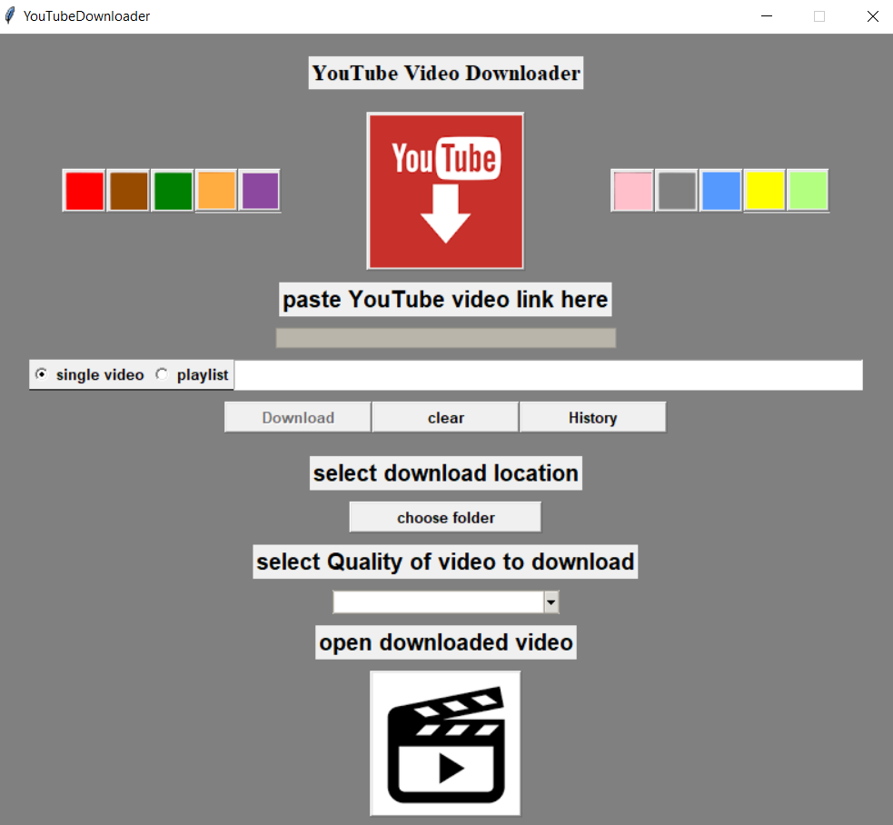

# YouTube Video Downloader

- A Desktop application to download youtube video and playlist with the help of Link of That perticular video and
playlist. 

# Modules Used

1 tkinter \
2 threading \
3 time \
4 pathlib \
5 urllib \
6 pytube3

- To install module...
- ```pip3 install -U < Module name >```

# How to Run
- Clone The Repository and run below command.
- ```python3 YoutubeVideoDownloader.py```

# Supported Formats of Video and Audio
- mp3
- webm
- 360p
- 720p
- 1080p
- 1440p
- 2160p

# Demo Screenshots


# Author
- D H R U V &nbsp; P R A J A P A T I

# Thank You!